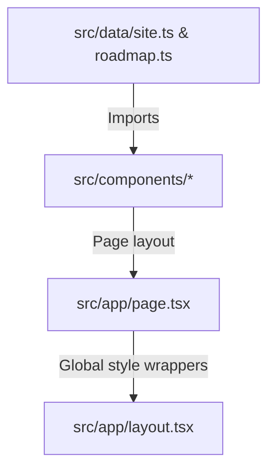

# SuiNS Roadmap Website — Architecture Overview

This document outlines the directory structure, data flow, and tooling conventions for the **SuiNS Roadmap Website** (`resources/suins/website/`).

---

## 1. Project Directory Structure

```
resources/suins/website/
├── docs/                      # Specification & design files
│   ├── AGENTS.md              # Guidelines for AI coding assistants
│   ├── design.md              # Design system & color tokens
│   ├── website_plan.md        # Technical build specification
│   └── feature_research_plan.md # Naming service feature research
├── src/
│   ├── app/
│   │   ├── layout.tsx         # Root HTML layout, Inter font setup, SEO metadata
│   │   ├── page.tsx           # Composes the page sections (Hero, Thesis, Showcase, Explorer)
│   │   └── globals.css        # Tailwind directives + utility classes
│   ├── components/
│   │   ├── Hero.tsx           # Page header, navigation, and main CTAs
│   │   ├── Thesis.tsx         # SuiNS core investment thesis & demand vector cards
│   │   ├── Showcase.tsx       # "Built on SuiNS" catalog showcase (e.g., Slush, Passki)
│   │   ├── RoadmapExplorer.tsx # Interactive timeline filter & status grid controller
│   │   ├── FeatureCard.tsx    # Renders feature details, money pill, and expands modal
│   │   ├── StatusBadge.tsx    # Status pills (Shipped, Building, Exploring)
│   │   └── Footer.tsx         # Bottom links and social navigation
│   └── data/
│       ├── roadmap.ts         # Authoritative database of roadmap features (typed)
│       └── site.ts            # Authoritative source of text content, hero copy, & links
├── tailwind.config.ts         # Color palette extension (sui-blue, navy, sky, aqua)
├── package.json               # Next.js 14 scripts & package dependencies
└── pnpm-lock.yaml             # Lockfile for pnpm package manager
```

---

## 2. Data Flow & Rendering

The application is built around **strict separation of content and presentation**:
*   **Static Data Modules**: All textual content, metadata, links, and roadmap states are defined as typed TS constants in `site.ts` and `roadmap.ts`. No raw copy is hardcoded directly inside JSX components.
*   **Dynamic UI Components**: React components import these constants and map them into the DOM. For example, `RoadmapExplorer` imports `roadmapFeatures` from `roadmap.ts` and allows users to filter them dynamically by status (Shipped, Building, Exploring) or view detailed modal overlays.



---

## 3. Developer & Environment Rules

Refer to [AGENTS.md](../AGENTS.md) for full assistant rules:
*   **Local Server**: Start only via `pnpm dev` (runs on port 3102).
*   **Build Restriction**: **Never** run `pnpm build` or `npm run build` during local development to avoid breaking chunk generation in the active dev server.
*   **Compilation / Lint checks**: Run `npx tsc --noEmit` to check types, and use Next.js's Vercel deployment pipeline to build/test production builds.

---

## 4. Feature Card Schema & Structure

Each roadmap feature is represented as a structured data object within `src/data/roadmap.ts` and rendered dynamically using the `FeatureCard` component.

### 4.1 Data Schema (`RoadmapFeature`)

The TypeScript interface in `src/data/roadmap.ts` defines the content and behavior capabilities of a feature card:

```typescript
export interface RoadmapFeature {
  title: string;
  status: "implemented" | "in-development" | "proposed";
  category: "naming" | "identity" | "payments" | "governance" | "social" | "infrastructure";
  launchDate: string;                  // Human-readable launch target (e.g. "August 2025")
  sortDate?: string;                   // YYYY-MM helper for chronological sorting
  howItWorks: string;                  // Always-visible concise description
  details?: string;                    // Detailed narrative for the modal view
  phases?: { title: string; body: string }[]; // Stepper roadmap phases (optional)
  audience: string;                    // Text describing audience impact
  audienceTag: "end-users" | "investors" | "both";
  monetization?: {
    generatesRevenue: boolean;
    model?: string;                    // Description of fee model (e.g. "2.5% of each auction")
    beneficiary?: string;              // Revenue destination (e.g. "DAO treasury")
  };
  builder?: string;                    // Developing entity or team
  builderLink?: string;                // Link to builder's X/GitHub profile
  openForBuilders?: boolean;           // Active RFP candidate indicator
  links?: {                            // Social and reference links
    github?: string;
    blogpost?: string;
    implementation?: string;
    twitter?: string;
    reference?: string;
  };
  whyItMatters?: string;               // Italicized strategic value statement
  demandVector?: ("websites" | "agents" | "payments" | "identity")[]; // Flywheel tags
  dependsOn?: string[];                // Title references to prerequisites
  unlocks?: string[];                  // Title references to dependent features
  precedent?: string;                  // Proven comparable (e.g. "ENS DNS Import")
  precedentLink?: string;              // Link to precedent documentation
}
```

### 4.2 UI Structure & Presentation

The card has two presentation states managed in `FeatureCard.tsx`:

#### Collapsed Card View
*   **Header**: Category icon, Title, Share button (chain-link icon), and Status Badge (`StatusBadge`).
*   **Metadata Badges**: Launch Date, Audience Tag, and Demand Vector Badges.
*   **Content**: Brief description (`howItWorks`), *Why It Matters* italicized line, and *Precedent* comparable link.
*   **Monetization Box**: Highlighted panel detailing protocol fee generation or tokenomics (if configured).
*   **Action Footer**: Clean button row with **Build it** (links to Discord RFP intake if open for builders), **Discuss** (links to Twitter/Blog/Discord), and **Track** (links to GitHub issue/repository).
*   **Expand Button**: Spans the full width to trigger modal view if details, phases, or dependencies are present.

#### Expanded Modal View
Rendered via React Portal onto the document body when expanded:
*   Includes all collapsed details with a fuller narrative (`details` falling back to `howItWorks`).
*   **Phase Stepper**: Multi-stage progress indicators.
*   **Dependency Pills**:
    *   **Requires**: Interactive prerequisite pills showing a checkmark (green/gray) for `implemented` status, or a lock icon (orange) for unfinished features.
    *   **Enables**: Interactive unlock outcomes.
    *   *Clicking any pill closes the current modal, updates the URL hash to the targeted feature, scrolls to its card, and triggers a border flash.*

### 4.3 Deep Linking & Interactive Behaviors
*   **Hash Generation**: URL-safe slugs are generated programmatically via `getFeatureSlug(title)`.
*   **Active Router**: A `useEffect` listener in `FeatureCard` monitors `hashchange` and page load. If the window hash matches the card slug, it:
    1. Smooth-scrolls the card container into view.
    2. Triggers the CSS `animate-flash` border animation.
    3. Auto-expands the card by opening its modal overlay.

